# GlassToolbar

[](https://swift.org)
[](https://developer.apple.com/ios/)
[](https://swift.org/package-manager/)
[](LICENSE)

Glass style custom toolbar built with UIKit and Auto Layout. Supports side floating buttons, bottom accessory views, and space-adaptive layouts.

## UI Overview

<details>
  <summary><strong>Plain Tool Bar</strong></summary>
  <br/>
  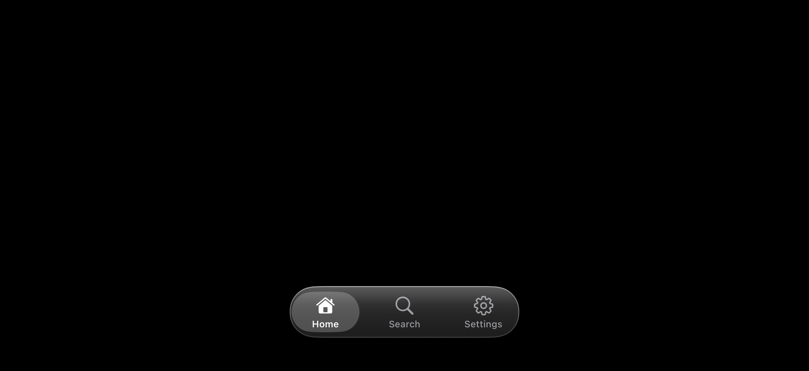
</details>

<details>
  <summary><strong>Tool Bar with Side Button & Accessory View</strong></summary>
  <br/>
  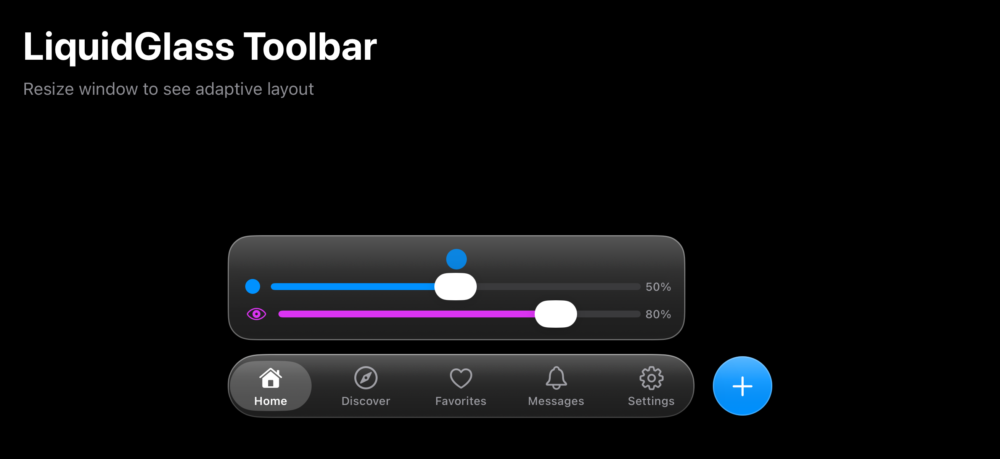
</details>

<details>
  <summary><strong>Tool Bar with Dual Accessory Views</strong></summary>
  <br/>
  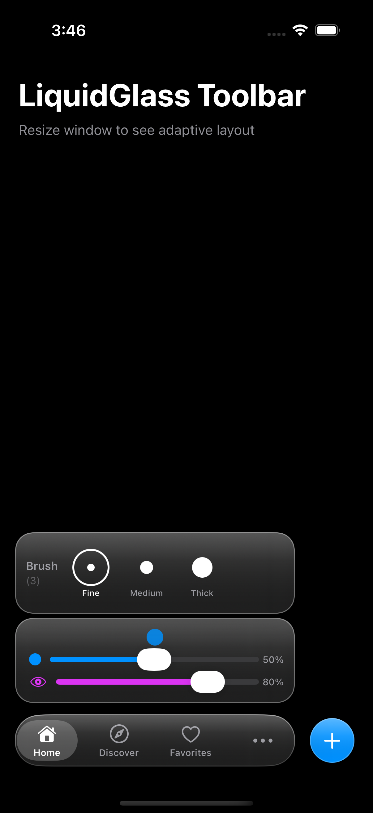
</details>

<details>
  <summary><strong>Tool Bar with More Action Menu</strong></summary>
  <br/>
  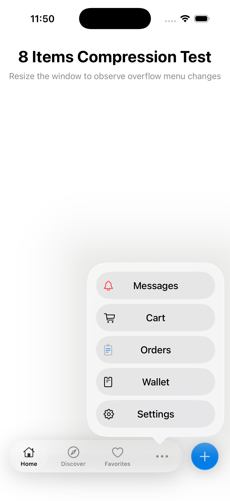
</details>

<details>
  <summary><strong>Adaptive Toolbar Layout for Split View</strong></summary>
  <br/>
  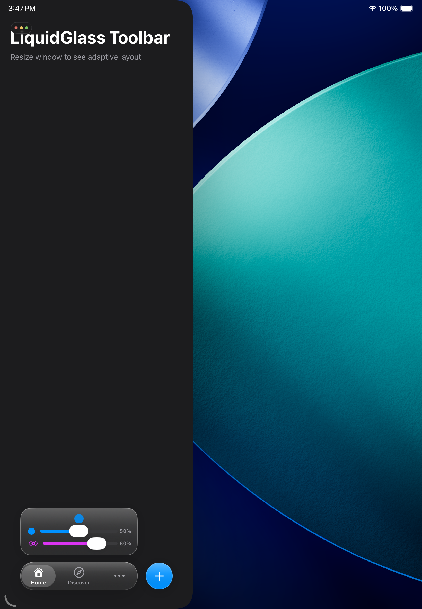
</details>

## Installation

### Swift Package Manager

In Xcode:
1. File → Add Package Dependencies...
2. Enter the repository URL
3. Select version rules

Or add to your `Package.swift`:

```swift
dependencies: [
    .package(url: "https://github.com/Humble7/GlassToolbar", from: "1.0.0")
]
```

## Features

### 1. Glass Toolbar
- Frosted glass background effect
- Dynamic gloss layer
- Selection indicator animation

### 2. Side Button (Floating Side Button)
- **Independent UI style from the toolbar**
- Multiple preset styles: glass, primary, secondary, success, warning, danger
- Custom icons and colors
- Tap animation and haptic feedback
- **Swipe gesture support** (up/down/left/right)
- **Space priority** (essential/primary/secondary)

### 3. Accessory View (Bottom Accessory View)
- Positioned above the toolbar
- Automatically gets Glass background
- Built-in accessories: mini player, quick actions, status info, progress bar
- Uses `GlassAccessoryProvider` protocol for unified lifecycle management

### 4. Space-Adaptive Layout (NEW)
- **Based on actual width** rather than Size Class for layout
- **5-level space tiers**: spacious/regular/compact/tight/minimal
- **Item priority**: essential (always visible)/primary/secondary/overflow
- **Progressive compression**: spacing→title→icon→hide
- **Overflow menu**: hidden items go into a more menu
- **Perfect iPad split-screen support**

### 5. Other Features
- Dark mode support

## File Structure

```
GlassToolbar/
├── Package.swift                           # SPM configuration
├── README.md                               # Documentation
├── LICENSE                                 # MIT License
├── CHANGELOG.md                            # Version changelog
│
├── Sources/GlassToolbar/
│   ├── Public/                             # Public API
│   │   ├── GlassToolbarController.swift
│   │   ├── GlassToolbarItem.swift
│   │   ├── GlassSideButtonConfig.swift
│   │   ├── GlassAccessoryProvider.swift
│   │   ├── ToolbarConfiguration.swift
│   │   └── HorizontalListAccessoryView.swift
│   │
│   ├── Internal/                           # Internal implementation
│   │   ├── View/
│   │   │   ├── GlassToolbarView.swift
│   │   │   └── GlassFloatingButton.swift
│   │   ├── Managers/
│   │   │   ├── AccessoryViewManager.swift
│   │   │   ├── SideButtonManager.swift
│   │   │   ├── ToolbarItemsManager.swift
│   │   │   ├── ToolbarConstraintsManager.swift
│   │   │   └── OverflowMenuHandler.swift
│   │   ├── Coordinators/
│   │   │   └── ToolbarStateCoordinator.swift
│   │   ├── Layout/
│   │   │   ├── ToolbarLayoutSystem.swift
│   │   │   ├── UltraMinimalModeHandler.swift
│   │   │   └── ToolbarPosition.swift
│   │   └── Animation/
│   │       └── ToolbarAnimator.swift
│   │
│   └── Accessories/                        # Built-in Accessory components
│       └── GlassAccessoryComponents.swift
│
├── Tests/GlassToolbarTests/          # Unit tests
│
└── Example/                                # Example App
    ├── GlassToolBar.xcodeproj
    └── GlassToolBar/
        └── ToolBar/Demo/
            ├── ToolbarDemos.swift
            └── DemoAccessoryView.swift
```

## Code Architecture

The Controller follows the **Single Responsibility Principle**, splitting complex logic into specialized manager/handler classes:

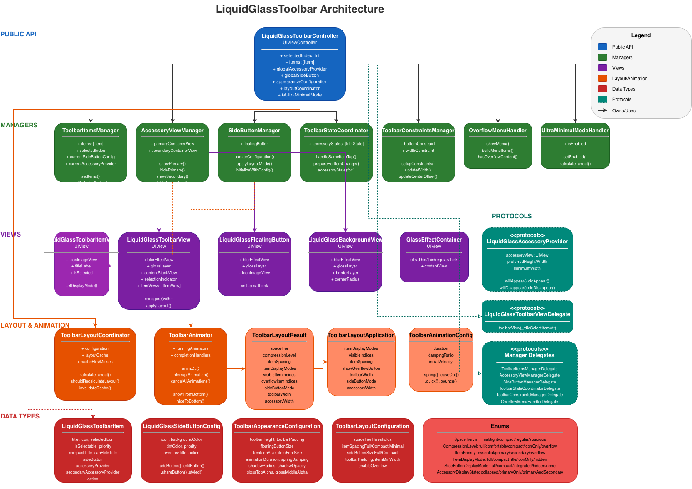

### Manager Responsibilities

| Manager/Handler | Responsibility | Delegate Protocol |
|----------------|----------------|-------------------|
| `ToolbarItemsManager` | Items management: items array, selection state, current config convenience access, cleanup | `ToolbarItemsManagerDelegate` |
| `SideButtonManager` | Side Button full lifecycle: creation, constraints, show/hide animation, layout mode adaptation | `SideButtonManagerDelegate` |
| `AccessoryViewManager` | Accessory View management: primary/secondary containers, Provider lifecycle callbacks, delayed display, animation | `AccessoryViewManagerDelegate` |
| `ToolbarStateCoordinator` | State machine logic: each item's Accessory expanded state, tap cycle logic, state transition calculation | `ToolbarStateCoordinatorDelegate` |
| `UltraMinimalModeHandler` | Ultra minimal mode management: state switching, layout calculation, finding most important item, mode recovery | `UltraMinimalModeHandlerDelegate` |
| `ToolbarConstraintsManager` | Constraints management: create/hold constraint references, update width/offset/bottom constraints | `ToolbarConstraintsManagerDelegate` |
| `OverflowMenuHandler` | Overflow menu: menu item building, ActionSheet display, iPad popover adaptation | `OverflowMenuHandlerDelegate` |

### Unified Layout Application Interface

The `ToolbarLayoutApplication` struct unifies `ToolbarLayoutResult` and `UltraMinimalLayoutResult` layout application:

```swift
// Both layout results can be converted to unified application params
let params = layoutResult.toApplicationParams()
let ultraParams = ultraMinimalResult.toApplicationParams()

// Controller applies layout through unified method
private func performLayoutApplication(_ params: ToolbarLayoutApplication, animated: Bool)
```

This avoids duplicate code in the Controller. UltraMinimalModeHandler calls the same layout application logic through its delegate.

## Quick Start

### Basic Usage

```swift
import UIKit

class MyViewController: UIViewController {

    override func viewDidLoad() {
        super.viewDidLoad()

        // 1. Create toolbar controller
        let toolbarController = GlassToolbarController()

        // 2. Configure toolbar items
        let items: [GlassToolbarItem] = [
            GlassToolbarItem(
                title: "Home",
                icon: UIImage(systemName: "house"),
                selectedIcon: UIImage(systemName: "house.fill"),
                action: { print("Home tapped") }
            ),
            GlassToolbarItem(
                title: "Settings",
                icon: UIImage(systemName: "gearshape"),
                selectedIcon: UIImage(systemName: "gearshape.fill"),
                action: { print("Settings tapped") }
            )
        ]

        // 3. Set toolbar items
        toolbarController.setItems(items)

        // 4. Add to view (as overlay - touches pass through to content below)
        addChild(toolbarController)
        toolbarController.view.frame = view.bounds
        view.addSubview(toolbarController.view)
        toolbarController.didMove(toParent: self)
    }
}
```

> **Note**: The toolbar controller uses a passthrough view - touches on empty areas pass through to views below, so it can be safely used as an overlay without blocking content interaction.

### Adding Side Floating Button

Side Button supports two modes:

#### 1. Associated with Specific Item (Recommended)

```swift
// Set associated sideButton for specific items
let items: [GlassToolbarItem] = [
    GlassToolbarItem(
        title: "Home",
        icon: UIImage(systemName: "house"),
        sideButton: .addButton { print("Add") }  // Home shows add button
    ),
    GlassToolbarItem(
        title: "Favorites",
        icon: UIImage(systemName: "heart"),
        sideButton: .styled(.danger, icon: UIImage(systemName: "trash")) {
            print("Delete")  // Favorites shows delete button
        }
    ),
    GlassToolbarItem(
        title: "Settings",
        icon: UIImage(systemName: "gearshape")
        // Settings doesn't show side button
    )
]

controller.setItems(items)
```

#### 2. Global Side Button

```swift
// Set global sideButton (shown when item has no association)
controller.globalSideButton = .addButton { print("Add") }
```

**Priority:** Item-associated sideButton > Global globalSideButton

#### 3. Dynamic Update Side Button Appearance

You can dynamically update the side button's icon, background color, and tint color at runtime:

```swift
// Update icon only
controller.updateSideButtonAppearance(
    icon: UIImage(systemName: "checkmark")
)

// Update background color and tint color
controller.updateSideButtonAppearance(
    backgroundColor: .systemGreen,
    tintColor: .white
)

// Update all properties with animation
controller.updateSideButtonAppearance(
    icon: UIImage(systemName: "pause.fill"),
    backgroundColor: .systemGreen,
    tintColor: .white,
    animated: true
)

// Update without animation
controller.updateSideButtonAppearance(
    icon: UIImage(systemName: "stop.fill"),
    animated: false
)
```

**Example: Play/Pause Toggle**

```swift
var isPlaying = false

// Initial setup
sideButton: .styled(.primary, icon: UIImage(systemName: "play.fill"), action: { [weak self] in
    guard let self = self else { return }
    self.isPlaying.toggle()

    // Dynamically update appearance
    self.toolbarController.updateSideButtonAppearance(
        icon: UIImage(systemName: self.isPlaying ? "pause.fill" : "play.fill"),
        backgroundColor: self.isPlaying ? .systemGreen : .systemBlue
    )
})
```

**Notes:**
- Pass `nil` for any parameter to keep its current value
- `backgroundColor` update only works for non-glass buttons (`.glass` style uses blur effect)
- Animation duration is 0.25 seconds

#### 4. Dynamic Update Toolbar Item

You can dynamically update a toolbar item's icon and title using `updateItem(at:transform:)`:

```swift
// Update icon and title when brush is selected
toolbarController.updateItem(at: 0) { item in
    var updatedItem = item
    updatedItem.icon = UIImage(systemName: "pencil.tip")
    updatedItem.selectedIcon = UIImage(systemName: "pencil.tip")
    updatedItem.title = "Monoline"
    return updatedItem
}
```

**Notes:**
- Only updates the specified item without recreating all items
- Does not trigger accessory view animation
- Useful for syncing item appearance with accessory view selection

#### 5. Swipe Gesture Support

Side Button supports swipe gestures in four directions (up/down/left/right):

```swift
// Create side button with swipe gesture
let sideButton = GlassSideButtonConfig(
    icon: UIImage(systemName: "paintpalette.fill"),
    backgroundColor: .systemBlue,
    tintColor: .white,
    priority: .essential,
    gestures: SideButtonGestureConfig(
        onTap: {
            print("Tapped - show color picker")
        },
        onSwipe: { direction in
            switch direction {
            case .up: print("Swipe up - increase size")
            case .down: print("Swipe down - decrease size")
            case .left: print("Swipe left")
            case .right: print("Swipe right")
            }
        },
        enabledDirections: [.up, .down],  // Only enable up/down
        swipeThreshold: 30,               // Distance threshold (default 30pt)
        swipeVelocityThreshold: 200       // Velocity threshold (default 200pt/s)
    )
)
```

**Using convenience initializer:**

```swift
// Quick creation with swipe support
sideButton: .styled(
    .primary,
    icon: UIImage(systemName: "paintbrush"),
    onTap: { print("Tap") },
    onSwipe: { direction in print("Swipe: \(direction)") },
    enabledDirections: [.up, .down, .left, .right]
)
```

**SwipeDirection:**

| Direction | Description |
|-----------|-------------|
| `.up` | Swipe upward |
| `.down` | Swipe downward |
| `.left` | Swipe left |
| `.right` | Swipe right |

**Visual Feedback:**
- Start swiping: slight scale down (0.95)
- During swipe: follows finger with limited offset (max 8pt)
- Trigger threshold: haptic feedback + direction bounce animation
- Release: spring animation back to position

### Adding Bottom Accessory View

Accessory View uses the `GlassAccessoryProvider` protocol, supporting lifecycle management (willAppear/didAppear/willDisappear/didDisappear).

#### 1. Associated with Specific Item

```swift
// Create different accessory views (all conform to GlassAccessoryProvider protocol)
let miniPlayer = MiniPlayerAccessoryView()
miniPlayer.configure(title: "Song Name", artist: "Artist")

let statusView = StatusAccessoryView()
statusView.configure(icon: UIImage(systemName: "wifi"), title: "Connected", subtitle: "Network Good")

let items: [GlassToolbarItem] = [
    GlassToolbarItem(
        title: "Home",
        icon: UIImage(systemName: "house"),
        accessoryProvider: miniPlayer  // Home shows mini player
    ),
    GlassToolbarItem(
        title: "Discover",
        icon: UIImage(systemName: "safari")
        // Discover doesn't show accessory
    ),
    GlassToolbarItem(
        title: "Settings",
        icon: UIImage(systemName: "gearshape"),
        accessoryProvider: statusView  // Settings shows status info
    )
]
```


#### 2. Global Accessory Provider

```swift
// Set global accessoryProvider (shown when item has no association)
let globalPlayer = MiniPlayerAccessoryView()
controller.globalAccessoryProvider = globalPlayer
```

**Priority:** Item-associated accessoryProvider > Global globalAccessoryProvider

#### 3. Combining Side Button and Accessory Provider

```swift
GlassToolbarItem(
    title: "Home",
    icon: UIImage(systemName: "house"),
    sideButton: .addButton { print("Add") },
    accessoryProvider: miniPlayer  // Configure both components
)
```

#### 4. Secondary Accessory Provider

Supports binding a secondary accessoryProvider to an item, triggered when tapping the same item while primary is visible.

```swift
// Create brush list as secondary accessoryProvider
let brushListView = HorizontalListAccessoryView()
brushListView.configure(title: "Brushes", items: [
    .init(icon: UIImage(systemName: "pencil.tip"), title: "Fine"),
    .init(icon: UIImage(systemName: "paintbrush"), title: "Medium"),
    .init(icon: UIImage(systemName: "paintbrush.pointed"), title: "Thick")
], selectedIndex: 1, configuration: .init(showsSelection: true, showsCount: true, selectionColor: .label))

GlassToolbarItem(
    title: "Home",
    icon: UIImage(systemName: "house"),
    accessoryProvider: dualSliderView,           // Primary accessory
    secondaryAccessoryProvider: brushListView    // Secondary accessory
)
```

**Trigger Logic (Tap Cycle):**
1. First selection → Show primary accessoryView
2. Tap again → Show secondary accessoryView (if available)
3. Tap again → Hide secondary accessoryView
4. Tap again → Hide primary accessoryView
5. Tap again → Show primary accessoryView (cycle back to step 1)

**State Preservation on Item Switch:**
- Switch to other item → Visually hidden, but **state preserved**
- Switch back to original item → **Auto-restore** to previous state

**Layout:**
- Secondary accessoryView is above primary, with 4pt spacing
- Width/position rules same as primary

#### 5. Non-Selectable Items

Supports setting items as non-selectable, only triggering action callback on tap without switching pages.

```swift
GlassToolbarItem(
    title: "Discover",
    icon: UIImage(systemName: "safari"),
    isSelectable: false,  // Set as non-selectable
    action: {
        // Action executed on tap (e.g., open external link)
        print("Discover button tapped")
    }
)
```

**Behavior:**
- Triggers `action` callback on tap
- Doesn't change toolbar selection state
- Has tap feedback animation
- Use cases: opening external links, presenting modal pages, triggering specific actions, etc.

### Component Animations

#### Side Button Animation
| Action | Animation Effect |
|--------|-----------------|
| **Show** | Slide out from Toolbar right side (with spring bounce) |
| **Hide** | Slide in behind Toolbar to the left |
| **Switch** | Old button slides in → New button slides out |

#### Accessory View Animation
| Action | Animation Effect |
|--------|-----------------|
| **Show** | Slide in from bottom (with spring bounce) |
| **Hide** | Slide out downward |
| **Switch item** | Show/hide based on target item state |

#### Secondary Accessory View Animation
| Action | Animation Effect |
|--------|-----------------|
| **Show** | Slide in from bottom (with spring bounce) |
| **Hide** | Slide out downward |
| **Switch item** | Visually hidden, state preserved |
| **Switch back** | Auto-restore display (if previously expanded) |

### Floating Button Preset Styles

| Style | Description | Example |
|-------|-------------|---------|
| `.glass` | Pure glass effect | Transparent background + frosted glass |
| `.primary` | Primary color | Blue background |
| `.secondary` | Secondary color | Gray background |
| `.success` | Success color | Green background |
| `.warning` | Warning color | Orange background |
| `.danger` | Danger color | Red background |

### Built-in Accessory View Types

```swift
// Dual slider controller (with circular preview)
let dualSliderView = DualSliderAccessoryView()
dualSliderView.configure(
    icon1: UIImage(systemName: "circle.fill"),      // Size control icon
    icon2: UIImage(systemName: "eye"),              // Opacity control icon
    value1: 0.5,  // Initial size
    value2: 0.8,  // Initial opacity
    color1: .systemPink,
    color2: .systemPurple,
    circleColor: .systemRed  // Circle color
)
// Slider1 controls circle size (16pt ~ 44pt)
// Slider2 controls circle opacity (20% ~ 100%)
dualSliderView.onSlider1Changed = { value in print("Size: \(value)") }
dualSliderView.onSlider2Changed = { value in print("Opacity: \(value)") }

// Favorites list (horizontal scroll)
let favoritesView = FavoritesListAccessoryView()
favoritesView.configure(title: "Favorites", items: [
    .init(icon: UIImage(systemName: "doc.fill"), title: "Document", color: .systemBlue),
    .init(icon: UIImage(systemName: "photo.fill"), title: "Photo", color: .systemGreen),
    .init(icon: UIImage(systemName: "music.note"), title: "Music", color: .systemPink)
])
favoritesView.onItemTap = { index in print("Tapped: \(index)") }

// Horizontal list (horizontal scroll, with configurable selection state)
let brushListView = HorizontalListAccessoryView()
brushListView.configure(title: "Brushes", items: [
    .init(icon: UIImage(systemName: "pencil.tip"), title: "Fine"),
    .init(icon: UIImage(systemName: "paintbrush"), title: "Medium"),
    .init(icon: UIImage(systemName: "paintbrush.pointed"), title: "Thick"),
    .init(icon: UIImage(systemName: "highlighter"), title: "Marker")
], selectedIndex: 1, configuration: .init(
    showsSelection: true,      // Show selection ring
    showsCount: true,          // Show item count
    selectionColor: .label,    // Icon/label color when selected
    borderColor: .systemBlue   // Selection ring border color (optional)
))
brushListView.onItemTap = { index in print("Selected brush: \(index)") }

// Without selection (for action buttons like share options)
let shareListView = HorizontalListAccessoryView()
shareListView.configure(title: "Share", items: [
    .init(icon: UIImage(systemName: "doc.on.doc"), title: "Copy"),
    .init(icon: UIImage(systemName: "message"), title: "Message"),
    .init(icon: UIImage(systemName: "envelope"), title: "Mail")
], configuration: .noSelection)  // No selection ring, no count
shareListView.onItemTap = { index in print("Share action: \(index)") }

// Mini player
let miniPlayer = MiniPlayerAccessoryView()
miniPlayer.configure(title: "Song Name", artist: "Artist")
miniPlayer.onPlayPause = { isPlaying in print("Playing: \(isPlaying)") }

// Status info
let statusView = StatusAccessoryView()
statusView.configure(
    icon: UIImage(systemName: "wifi"),
    title: "Connected",
    subtitle: "Network status good",
    statusColor: .systemGreen
)

// Progress bar
let progressView = ProgressAccessoryView()
progressView.configure(title: "Downloading...", progress: 0.65)

// Quick actions
let quickActions = QuickActionAccessoryView()
quickActions.configure(actions: [
    (icon: UIImage(systemName: "square.and.arrow.up"), title: "Share"),
    (icon: UIImage(systemName: "bookmark"), title: "Bookmark")
])
```

### Built-in Accessory View Overview

| View | Description | Use Cases |
|------|-------------|-----------|
| `DualSliderAccessoryView` | Dual slider + circular preview | Size/opacity adjustment, color selection |
| `FavoritesListAccessoryView` | Favorites list horizontal scroll | Quick entries, favorites folder |
| `HorizontalListAccessoryView` | Horizontal list with configurable selection | Tool selection, share options, action buttons |
| `MiniPlayerAccessoryView` | Mini player | Music playback control |
| `StatusAccessoryView` | Status info display | Network status, sync status |
| `ProgressAccessoryView` | Progress bar display | Download, upload progress |
| `QuickActionAccessoryView` | Quick action buttons | Share, bookmark actions |

## Space-Adaptive Layout

### Space Tier

Based on actual container width (not Size Class):

| Tier | Width Range | Typical Scenario |
|------|-------------|------------------|
| `spacious` | ≥520pt | iPad fullscreen, large split |
| `regular` | 420-519pt | iPad 1/2 split |
| `compact` | 360-419pt | Standard iPhone |
| `tight` | 280-359pt | iPhone SE, very small split |
| `minimal` | <280pt | Extreme cases, Slide Over |

### Item Priority

```swift
GlassToolbarItem(
    title: "Home",
    icon: UIImage(systemName: "house"),
    priority: .essential,  // Always visible, never hidden
    compactTitle: "Home",  // Short title for compact mode
    canHideTitle: true     // Allow hiding title, show icon only
)
```

| Priority | Behavior |
|----------|----------|
| `.essential` | Always visible, never hidden |
| `.primary` | Shown preferentially, can be compressed in extreme cases |
| `.secondary` | Hidden first when space is insufficient / moved to overflow |
| `.overflow` | Default in overflow menu |

### Side Button Priority

```swift
sideButton: .addButton(priority: .essential)  // Always visible
sideButton: .moreButton(priority: .secondary) // Can be hidden
```

### Compression Strategy

Progressive compression from sufficient to insufficient space:

<details>
  <summary><strong>Stage 0: Full display + titles</strong></summary>
  <br/>
  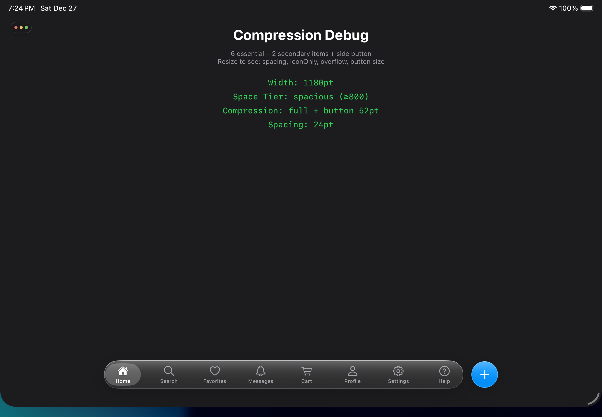
</details>

<details>
  <summary><strong>Stage 1: Reduced spacing</strong></summary>
  <br/>
  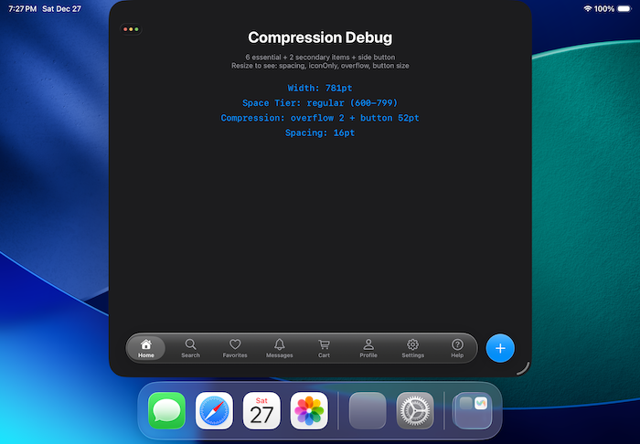
</details>

<details>
  <summary><strong>Stage 2: shows icon only(Secondary goes to overflow)</strong></summary>
  <br/>
  
</details>


### Custom Layout Configuration

```swift
// Custom space thresholds
var config = ToolbarLayoutConfiguration.default
config.spaceTierThresholds.spacious = 600  // Adjust spacious threshold
config.spaceTierThresholds.compact = 380   // Adjust compact threshold

// Custom spacing
config.itemSpacingFull = 20
config.itemSpacingCompact = 10

// Apply configuration
controller.layoutConfiguration = config
```

### Accessory View Width Strategy

Accessory View width follows Toolbar width with intelligent clamping to ensure usability across all screen sizes:

```
Accessory Width = clamp(accessoryMinWidth, toolbarWidth, accessoryMaxWidth)
                = clamp(200pt, toolbarWidth, 400pt)
```

#### Width Behavior by Space Tier

| Space Tier | Width Strategy | Rationale |
|------------|---------------|-----------|
| spacious | `min(toolbarWidth, 400pt)` | Prevent overly wide accessory on large screens |
| regular | `min(toolbarWidth, 400pt)` | Follow toolbar with max limit |
| compact | `min(toolbarWidth, 400pt)` | Follow toolbar with max limit |
| tight | `max(toolbarWidth, 200pt)` | Ensure minimum usable width |
| minimal | `200pt` | Fixed minimum width |

#### Visual Example

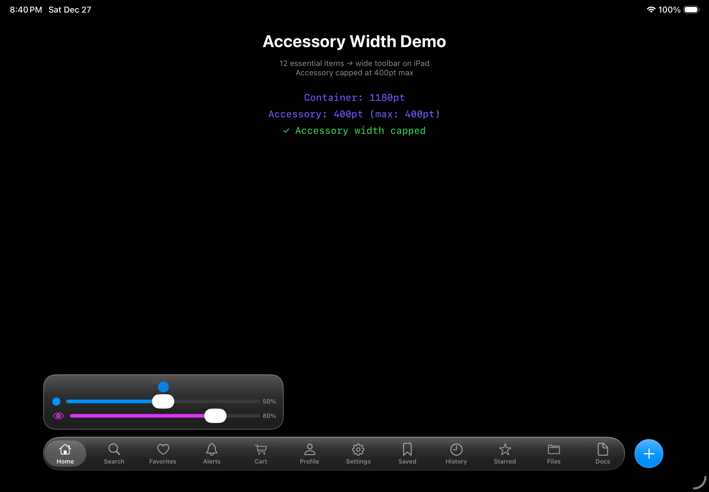

### Layout Caching Mechanism

The layout system has a built-in intelligent caching mechanism to avoid redundant calculations and improve performance:

#### Caching Strategy

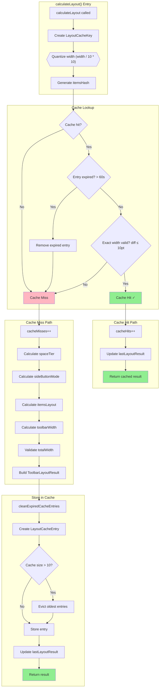

#### Cache Key Components

| Component | Description |
|-----------|-------------|
| `quantizedWidth` | Container width (quantized to 10pt precision) |
| `itemCount` | Number of items |
| `hasSideButton` | Whether has side button |
| `hasAccessory` | Whether has accessory view |
| `itemsHash` | Hash of items priority configuration |

#### Cache Parameters

| Parameter | Default | Description |
|-----------|---------|-------------|
| `maxCacheEntries` | 10 | Maximum cache entries |
| `cacheExpirationInterval` | 60 seconds | Cache expiration time |
| Width quantization precision | 10pt | Improves cache hit rate |

#### Auto-Invalidation Scenarios

Cache is automatically invalidated when:

- Calling `setItems(_:)` to set new items
- Modifying `globalAccessoryProvider`
- Modifying `globalSideButton`
- Modifying `layoutConfiguration`

#### Cache Eviction Policy

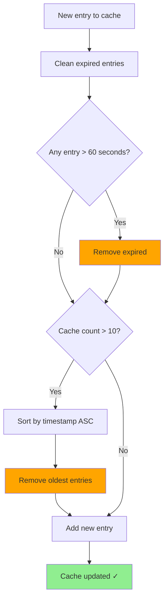

#### Manual Cache Invalidation

```swift
// Manually clear layout cache if needed
controller.layoutCoordinator.invalidateCache()
```

#### Cache Statistics (for debugging)

```swift
// Check cache hit rate
let hits = controller.layoutCoordinator.cacheHits
let misses = controller.layoutCoordinator.cacheMisses
let hitRate = Double(hits) / Double(hits + misses) * 100
print("Cache hit rate: \(hitRate)%")
```

#### Quick Recalculation Check

The `shouldRecalculateLayout()` method provides a fast pre-check to avoid unnecessary cache lookups:

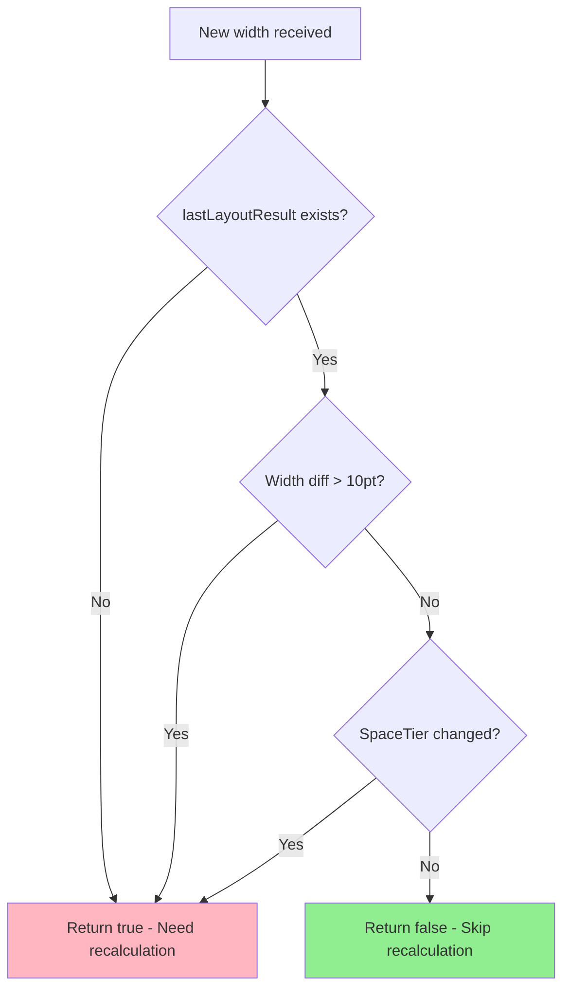

## Layout Diagram


**Spacing Specifications:**
- Toolbar left margin: 16pt
- **Side Button always follows Toolbar right side, fixed 16pt spacing**
- Side Button size: 48×48pt (default) / 44×44pt (compact) / 56×56pt (spacious)
- Toolbar height: 56pt
- Accessory View height: adaptive (based on content)
- Accessory View width: follows Toolbar width, clamped to 200-400pt range
- **Accessory View leading aligned with Toolbar leading**
- **Secondary Accessory View above primary, 4pt spacing**
- When minimized, Side Button moves with Toolbar

## API Reference

### GlassToolbarController

| Property/Method | Type | Description |
|----------------|------|-------------|
| `selectedIndex` | `Int` | Currently selected item index |
| `items` | `[GlassToolbarItem]` | All toolbar items |
| `globalAccessoryProvider` | `GlassAccessoryProvider?` | Global accessory provider (shown when item has no association) |
| `globalSideButton` | `GlassSideButtonConfig?` | Global side button (shown when item has no association) |
| `appearanceConfiguration` | `ToolbarAppearanceConfiguration` | Appearance configuration (sizes, animation params, etc.) |
| `layoutCoordinator` | `ToolbarLayoutCoordinator` | Layout coordinator (readonly, for cache statistics) |
| `isUltraMinimalMode` | `Bool` | Ultra minimal mode toggle |
| `setItems(_:)` | Method | Set toolbar items |
| `updateItem(at:transform:)` | Method | **Update single item dynamically** |
| `setUltraMinimalMode(_:animated:)` | Method | Set ultra minimal mode |
| `updateSideButtonAppearance(icon:backgroundColor:tintColor:animated:)` | Method | **Dynamically update side button appearance** |

### GlassToolbarItem

| Property | Type | Description |
|----------|------|-------------|
| `title` | `String` | Title (mutable) |
| `icon` | `UIImage?` | Default icon (mutable) |
| `selectedIcon` | `UIImage?` | Selected icon (mutable) |
| `isSelectable` | `Bool` | Whether selectable (default true) |
| `priority` | `ItemPriority` | **Compression priority (default .primary)** |
| `compactTitle` | `String?` | **Short title for compact mode** |
| `canHideTitle` | `Bool` | **Whether title can be hidden (default true)** |
| `sideButton` | `GlassSideButtonConfig?` | Associated side button |
| `accessoryProvider` | `GlassAccessoryProvider?` | Associated primary accessory provider |
| `secondaryAccessoryProvider` | `GlassAccessoryProvider?` | Associated secondary accessory provider |
| `action` | `(() -> Void)?` | Tap callback |

### GlassAccessoryProvider (Protocol)

All Accessory Views must conform to this protocol for lifecycle management:

| Property/Method | Type | Description |
|----------------|------|-------------|
| `accessoryView` | `UIView` | Actual view instance |
| `preferredHeight` | `CGFloat` | Preferred height (for layout calculation) |
| `preferredWidth` | `CGFloat?` | Preferred width (nil for adaptive) |
| `minimumWidth` | `CGFloat` | Minimum width (for compression scenarios, default 100) |
| `willAppear(animated:)` | Method | Called when about to appear |
| `didAppear(animated:)` | Method | Called after appearing |
| `willDisappear(animated:)` | Method | Called when about to disappear |
| `didDisappear(animated:)` | Method | Called after disappearing |
| `cleanup()` | Method | Clean up resources (closures, timers, etc.) |

**Built-in implementations:** All built-in Accessory Views (MiniPlayerAccessoryView, DualSliderAccessoryView, etc.) implement this protocol.

### HorizontalListAccessoryView

A versatile horizontal scrolling list with configurable selection state.

#### ListItem

| Property | Type | Description |
|----------|------|-------------|
| `icon` | `UIImage?` | Item icon |
| `title` | `String` | Item title |
| `tintColor` | `UIColor` | Icon tint color (default: `.label`) |

#### Configuration

| Property | Type | Default | Description |
|----------|------|---------|-------------|
| `showsSelection` | `Bool` | `true` | Whether to show selection ring |
| `showsCount` | `Bool` | `true` | Whether to show item count in title |
| `selectionColor` | `UIColor` | `.label` | Icon/label color when selected (adapts to light/dark mode) |
| `borderColor` | `UIColor?` | `nil` | Selection ring border color (nil uses `selectionColor`) |

#### Preset Configurations

| Preset | Description |
|--------|-------------|
| `.default` | Selection enabled, count shown |
| `.noSelection` | No selection ring, no count (for action buttons) |

#### Methods

| Method | Description |
|--------|-------------|
| `configure(title:items:selectedIndex:configuration:)` | Configure the list |
| `updateSelectionColor(_:)` | Update icon/label selection color |
| `updateBorderColor(_:)` | Update only the ring border color |

### ItemPriority

| Value | Description |
|-------|-------------|
| `.essential` | Always visible, never hidden |
| `.primary` | Shown preferentially, can be compressed in extreme cases (default) |
| `.secondary` | Hidden first when space is insufficient |
| `.overflow` | Default in overflow menu |

### GlassSideButtonConfig

| Property | Type | Description |
|----------|------|-------------|
| `icon` | `UIImage?` | Button icon |
| `backgroundColor` | `UIColor` | Background color (.clear for glass effect) |
| `tintColor` | `UIColor` | Icon color |
| `priority` | `SideButtonPriority` | **Compression priority (default .primary)** |
| `overflowTitle` | `String?` | **Title in overflow menu** |
| `action` | `(() -> Void)?` | Tap callback (legacy, use `gestures.onTap` for new code) |
| `gestures` | `SideButtonGestureConfig?` | **Gesture configuration (tap + swipe)** |

### SideButtonGestureConfig

| Property | Type | Description |
|----------|------|-------------|
| `onTap` | `(() -> Void)?` | Tap gesture callback |
| `onSwipe` | `((SwipeDirection) -> Void)?` | Swipe gesture callback |
| `enabledDirections` | `Set<SwipeDirection>` | Enabled swipe directions (default: all) |
| `swipeThreshold` | `CGFloat` | Distance threshold to trigger swipe (default: 30pt) |
| `swipeVelocityThreshold` | `CGFloat` | Velocity threshold to trigger swipe (default: 200pt/s) |

### SwipeDirection

| Value | Description |
|-------|-------------|
| `.up` | Swipe upward |
| `.down` | Swipe downward |
| `.left` | Swipe left |
| `.right` | Swipe right |

### SideButtonPriority

| Value | Description |
|-------|-------------|
| `.essential` | Always visible, cannot be hidden |
| `.primary` | Shown preferentially, can be merged in extreme cases (default) |
| `.secondary` | Can be hidden when space is insufficient |

### Preset Button Configurations

```swift
// Quick creation (supports priority parameter)
.addButton(priority: .essential, action:)     // Add button
.editButton(priority: .primary, action:)      // Edit button
.shareButton(priority: .secondary, action:)   // Share button
.moreButton(priority: .secondary, action:)    // More button

// Styled creation
.styled(_ style:, icon:, priority:, overflowTitle:, action:)
```

### ToolbarLayoutConfiguration

| Property | Type | Description |
|----------|------|-------------|
| `spaceTierThresholds` | `SpaceTierThresholds` | Space tier thresholds |
| `itemSpacingFull` | `CGFloat` | Full mode spacing (default 16) |
| `itemSpacingCompact` | `CGFloat` | Compact mode spacing (default 8) |
| `sideButtonSizeFull` | `CGFloat` | Side Button full size (default 52) |
| `sideButtonSizeCompact` | `CGFloat` | Side Button compact size (default 44) |
| `toolbarInternalPadding` | `CGFloat` | Toolbar internal padding (default 24) |
| `accessoryMaxWidth` | `CGFloat` | **Accessory View maximum width (default 400)** |
| `accessoryMinWidth` | `CGFloat` | **Accessory View minimum width (default 200)** |
| `enableOverflow` | `Bool` | Whether to enable overflow menu (default true) |

### ToolbarAppearanceConfiguration

Appearance configuration with dependency injection support, **all visual parameters are configurable**.

> **Design Guidelines**: All sizes follow the **8pt grid system**, spacing unified to **4/8/12/16/24** five levels, touch targets minimum **44pt**.

#### Size Configuration

| Property | Type | Default | Description |
|----------|------|---------|-------------|
| `toolbarHeight` | `CGFloat` | 56 | Toolbar height |
| `toolbarPadding` | `CGFloat` | 16 | Toolbar padding |
| `floatingButtonSize` | `CGFloat` | 48 | Floating button size |
| `toolbarToSideButtonSpacing` | `CGFloat` | 16 | Toolbar to Side Button spacing |
| `itemIconSize` | `CGFloat` | 24 | Item icon size |
| `itemFullSize` | `CGSize` | 56×48 | Item full size |
| `itemCompactSize` | `CGSize` | 44×48 | Item compact size (icon only) |
| `itemFontSize` | `CGFloat` | 10 | Item title font size |
| `floatingButtonIconSize` | `CGFloat` | 24 | Floating button icon size |

#### Animation Configuration

| Property | Type | Default | Description |
|----------|------|---------|-------------|
| `animationDuration` | `TimeInterval` | 0.35 | Animation duration |
| `springDamping` | `CGFloat` | 0.85 | Spring damping |
| `springVelocity` | `CGFloat` | 0.5 | Spring initial velocity |
| `animationTranslationY` | `CGFloat` | 32 | Animation vertical translation |
| `secondaryAccessoryShowDelay` | `TimeInterval` | 0.15 | Secondary Accessory show delay |
| `tapScaleFactor` | `CGFloat` | 0.88 | Tap scale factor |
| `pressScaleFactor` | `CGFloat` | 0.92 | Press scale factor |
| `pressAlpha` | `CGFloat` | 0.85 | Press opacity |
| `selectionAnimationDuration` | `TimeInterval` | 0.35 | Selection indicator animation duration |
| `selectionSpringDamping` | `CGFloat` | 0.7 | Selection indicator spring damping |

#### Shadow Configuration

| Property | Type | Default | Description |
|----------|------|---------|-------------|
| `toolbarShadowRadius` | `CGFloat` | 20 | Toolbar shadow radius |
| `toolbarShadowOpacity` | `Float` | 0.18 | Toolbar shadow opacity |
| `toolbarShadowOffset` | `CGSize` | (0, 8) | Toolbar shadow offset |
| `floatingButtonShadowRadius` | `CGFloat` | 12 | Floating button shadow radius |
| `floatingButtonShadowOpacity` | `Float` | 0.18 | Floating button shadow opacity |
| `floatingButtonShadowOffset` | `CGSize` | (0, 4) | Floating button shadow offset |

#### Glass Effect Configuration

| Property | Type | Default | Description |
|----------|------|---------|-------------|
| `glossTopAlpha` | `CGFloat` | 0.28 | Gloss top opacity |
| `glossMiddleAlpha` | `CGFloat` | 0.08 | Gloss middle opacity |
| `borderTopAlpha` | `CGFloat` | 0.5 | Border top opacity |
| `borderBottomAlpha` | `CGFloat` | 0.15 | Border bottom opacity |
| `selectionIndicatorAlpha` | `CGFloat` | 0.22 | Selection indicator opacity |

#### Accessory Configuration

| Property | Type | Default | Description |
|----------|------|---------|-------------|
| `accessoryToToolbarSpacing` | `CGFloat` | 8 | Accessory to Toolbar spacing |
| `secondaryAccessorySpacing` | `CGFloat` | 4 | Secondary Accessory spacing |
| `accessoryContentInsets` | `UIEdgeInsets` | 12/12/12/12 | Accessory content insets |
| `accessoryCornerRadius` | `CGFloat` | 20 | Accessory view corner radius |

#### Ultra Minimal Mode Configuration

| Property | Type | Default | Description |
|----------|------|---------|-------------|
| `ultraMinimalItemWidth` | `CGFloat` | 44 | Ultra minimal mode item width |
| `ultraMinimalToolbarPadding` | `CGFloat` | 24 | Ultra minimal mode toolbar padding |
| `ultraMinimalSideButtonSize` | `CGFloat` | 44 | Ultra minimal mode Side Button size |

#### Corner Radius Configuration

| Property | Type | Default | Description |
|----------|------|---------|-------------|
| `toolbarCornerRadius` | `CGFloat?` | nil | Toolbar corner radius (nil auto-calculates as toolbarHeight/2) |
| `selectionIndicatorCornerRadius` | `CGFloat?` | nil | Selection indicator corner radius (nil auto-derived, see formula below) |
| `toolbarInternalPadding` | `CGFloat` | 4 | Toolbar internal horizontal padding |
| `selectionIndicatorHeight` | `CGFloat` | 44 | Selection indicator height (item height - 4pt) |
| `selectionIndicatorWidthInset` | `CGFloat` | -4 | Selection indicator width extension (negative means wider than item) |

#### Nested Corner Radius Auto-Derivation

When `selectionIndicatorCornerRadius` is nil, the system auto-calculates based on **nested corner radius design principles**:

```
Indicator corner radius = Toolbar corner radius - (Toolbar height - Indicator height) / 2
```

Get the final value through the computed property `effectiveSelectionIndicatorCornerRadius`. This ensures inner and outer corners present a **concentric arc** effect.

#### Preset Configurations

```swift
.default    // Standard configuration (iPhone)
.compact    // Compact configuration (small screens, ensures 44pt minimum touch target)
.spacious   // Spacious configuration (iPad)
```

#### Preset Configuration Comparison

| Config | toolbarHeight | itemFullSize | floatingButtonSize | minTouchTarget |
|--------|--------------|--------------|-------------------|----------------|
| `.default` | 56pt | 56×48 | 48pt | 44pt ✓ |
| `.compact` | 48pt | 48×44 | 44pt | 44pt ✓ |
| `.spacious` | 64pt | 64×56 | 56pt | 48pt ✓ |

#### Selection Indicator Size Comparison

| Config | Toolbar Height | Toolbar Radius | Indicator Height | **Indicator Radius** | Width Extension |
|--------|---------------|----------------|------------------|---------------------|-----------------|
| `.default` | 56pt | 28pt | 44pt | **22pt** (auto) | -4pt |
| `.compact` | 48pt | 24pt | 40pt | **20pt** (auto) | -4pt |
| `.spacious` | 64pt | 32pt | 52pt | **26pt** (auto) | -4pt |

> **Design Note**: Indicator corner radius is auto-derived to ensure concentric arc effect with Toolbar. Width extension -4pt means Indicator is 4pt wider than Item.

#### Spacing System

All presets follow the unified **4/8/12/16/24** spacing system:

| Spacing Level | Example Usage |
|--------------|---------------|
| **4pt** | Tight spacing (secondaryAccessorySpacing) |
| **8pt** | Small spacing (toolbarInternalPadding, default/compact accessoryToToolbarSpacing) |
| **12pt** | Medium spacing (spacious accessoryToToolbarSpacing, compact toolbarPadding) |
| **16pt** | Large spacing (default toolbarPadding, toolbarToSideButtonSpacing) |
| **24pt** | Extra large spacing (spacious toolbarPadding, ultraMinimalToolbarPadding) |

#### Custom Configuration Example

```swift
// Create custom configuration
var config = ToolbarAppearanceConfiguration.default

// Adjust animation feedback
config.tapScaleFactor = 0.85           // More noticeable tap feedback
config.pressAlpha = 0.75               // More noticeable press effect

// Adjust shadow effect
config.toolbarShadowOpacity = 0.25     // Deeper shadow
config.toolbarShadowRadius = 24        // Larger shadow range

// Adjust icon size (maintain 8pt grid)
config.itemIconSize = 28               // Larger icons
config.floatingButtonIconSize = 28     // Larger floating button icons

// Adjust glass effect
config.glossTopAlpha = 0.35            // Brighter gloss
config.selectionIndicatorAlpha = 0.30  // More noticeable selection effect

// Apply configuration
toolbarController.appearanceConfiguration = config
```

## Notes

1. **iOS Version**: Code compatible with iOS 17+
2. **Swift 6 Concurrency**: Full Swift 6 strict concurrency support
   - All UI components are `@MainActor` isolated
   - Value types conform to `Sendable`
   - Action closures are `@MainActor` annotated
3. **Memory Management**:
   - Use `weak` references to avoid retain cycles
   - Accessory Provider supports `cleanup()` method to release resources
   - Controller automatically cleans up all references on `deinit`
4. **Safe Area**: `safeAreaLayoutGuide` is considered
5. **Dark Mode**: Automatically adapts to system appearance
6. **Haptic Feedback**: Button taps include haptic feedback
7. **Interruptible Animation**: Uses `UIViewPropertyAnimator`, supports animation interruption and resume
8. **Touch Passthrough**: The controller's view only intercepts touches on toolbar-related components (Toolbar, Side Button, Accessory Views). Touches on empty areas pass through to views below, allowing the toolbar to be used as an overlay without blocking underlying content interaction.

## License

MIT License
